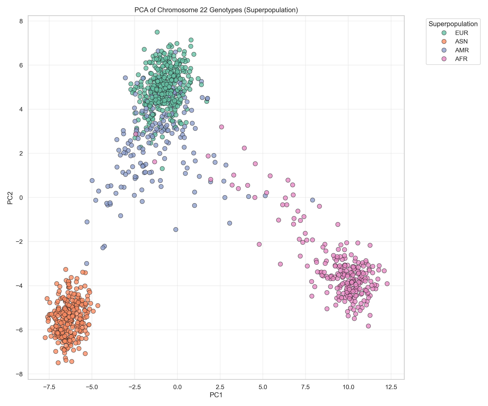
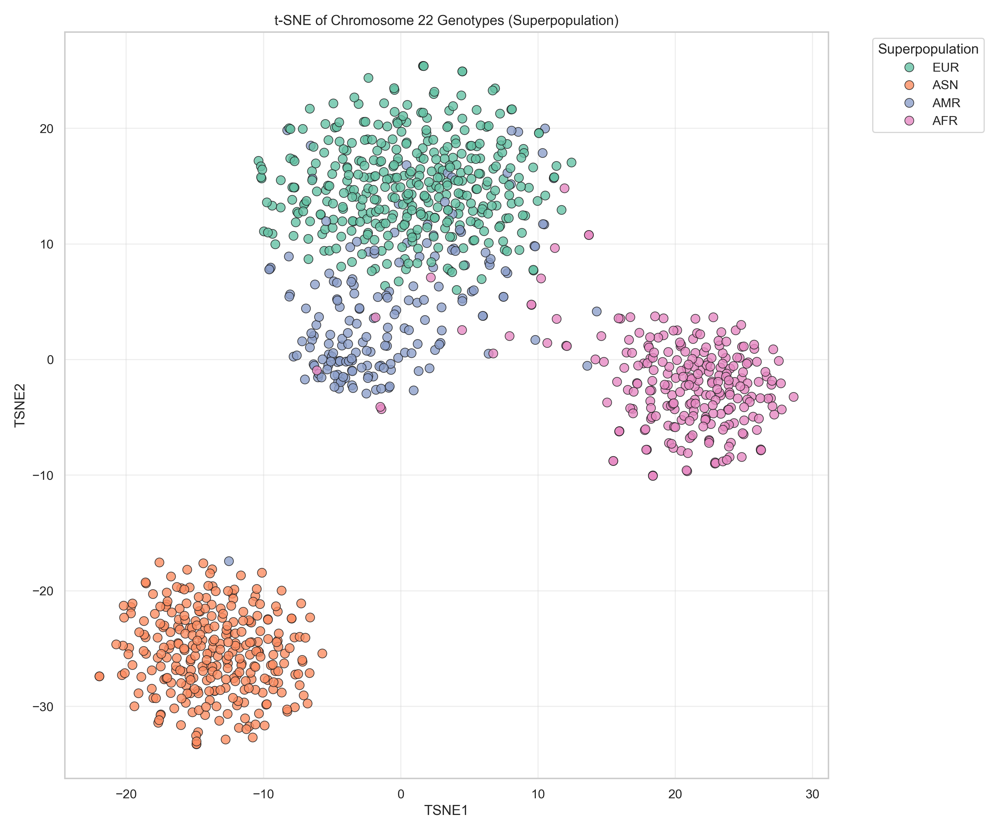
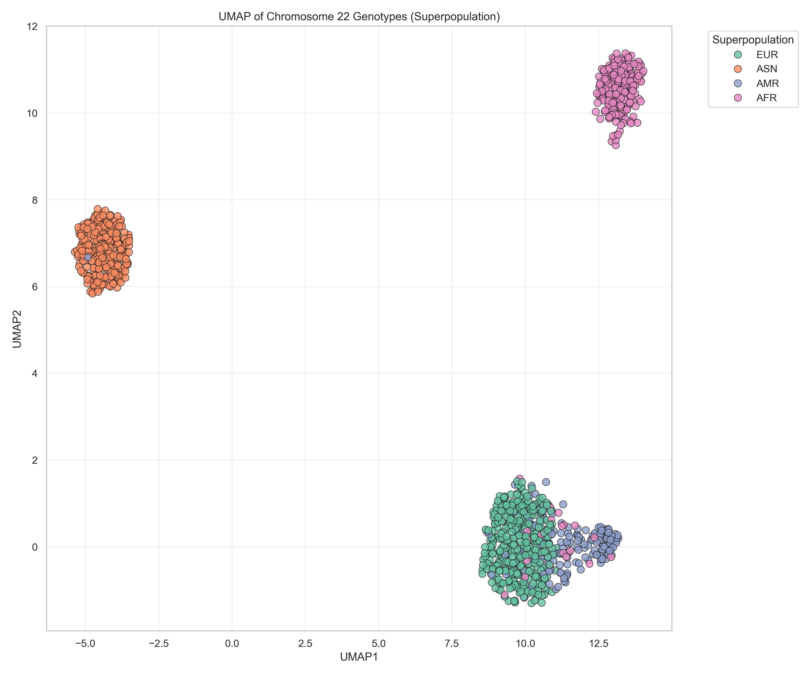

# Genes and Geography: Comparing PCA, t-SNE and UMAP on Genotype Data

## Overview
This project explores how effectively different dimensionality reduction techniques can be used to analyse and visualise human genetic variation. Using genotype data from the 1000 Genomes Project, the analysis compares Principal Component Analysis (PCA), t-SNE, and UMAP to understand how well each method captures population structure.

The focus of the project is on practical data analysis: preparing real-world data, applying machine learning techniques, and evaluating the strengths and limitations of each approach.

---

## Key Skills Demonstrated
- Python (pandas, NumPy, scikit-learn)
- Data cleaning and preprocessing
- Exploratory data analysis (EDA)
- Dimensionality reduction (PCA, t-SNE, UMAP)
- Data visualisation (matplotlib)
- Working with large, structured datasets
- Reproducible workflows using Jupyter Notebooks

---

## Dataset
The analysis uses genotype data from the **1000 Genomes Project**, focusing on Chromosome 22.

The dataset contains genetic variation data across multiple populations, along with metadata describing population and superpopulation groupings.

Due to file size constraints, the dataset is not included in this repository. Instructions for accessing the data are provided below.

---

## Methods

### PCA (Principal Component Analysis)
A linear dimensionality reduction method used to capture the largest sources of variance in the dataset. PCA provides a global overview of population structure and is useful for interpretation.

### t-SNE (t-Distributed Stochastic Neighbour Embedding)
A non-linear technique that focuses on preserving local structure in the data. It is effective at identifying clusters but can be sensitive to parameter choices and less interpretable globally.

### UMAP (Uniform Manifold Approximation and Projection)
A non-linear method that aims to preserve both local and global structure. It often provides clearer clustering than t-SNE while maintaining better overall structure.

---

## Results

The three methods produced distinct visualisations of population structure:

- **PCA** showed clear separation between major continental groups, making it useful for high-level interpretation.
- **t-SNE** produced tightly grouped clusters, revealing finer population structure, but with less meaningful global relationships.
- **UMAP** provided a balance between the two, preserving cluster detail while maintaining a more interpretable structure.

Example outputs:

  
  

---

## Key Findings
- PCA is the most interpretable method for understanding broad population structure.
- t-SNE is useful for identifying fine-grained clusters but is sensitive to parameters.
- UMAP provides a good balance between interpretability and clustering detail.
- Data preprocessing and parameter selection significantly impact results.

---

## Project Structure